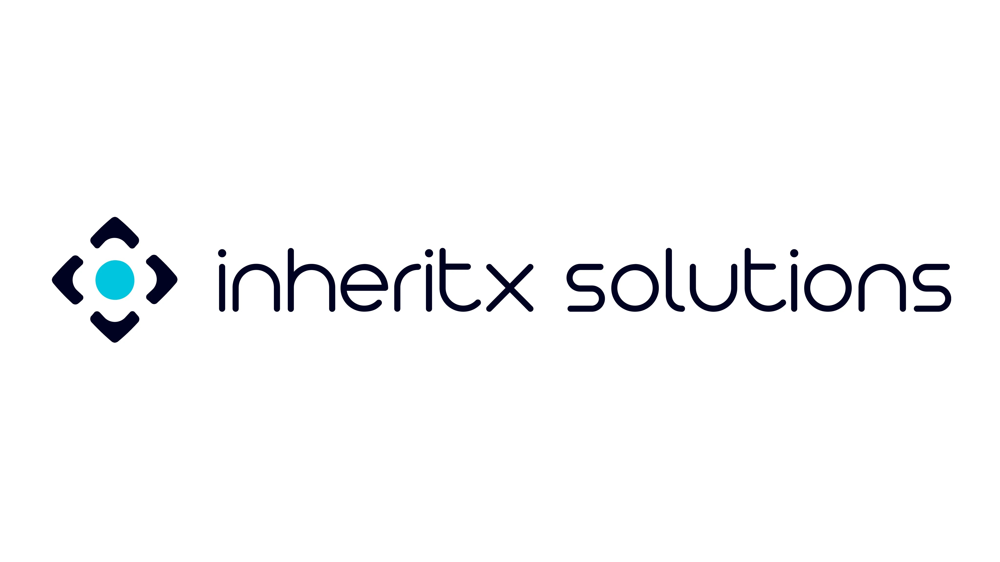

  

<h3 align="center">Building Scalable Digital Products with AI, Cloud & Mobility</h3>

---

## 🚀 About Us

**InheritX Solutions** is a global technology consulting and product engineering company delivering high-performance web, mobile, and AI-driven solutions for startups, SMEs, and enterprises.

Since **2011**, we help businesses transform ideas into scalable, secure, and future-ready digital products with a strong focus on performance and innovation.

---

## 💡 What We Do

* 📱 **Mobile App Development** (iOS, Android, Cross-platform)
* 🌐 **Web Application Development**
* 🤖 **AI / Machine Learning & Generative AI**
* ☁️ **Cloud & DevOps Engineering**
* 🎨 **UI/UX Design & Product Strategy**

---

## 🧠 Our Approach

* Agile & transparent development
* Scalable architecture & clean code
* Performance-first engineering
* Long-term technology partnership mindset

---

## 📊 Our Impact

* 🚀 850+ Projects Delivered
* 🌍 Global Client Base
* 🔁 97% Client Retention
* 👨‍💻 Experienced Engineering Team

---

## 🏗️ Tech Stack

**Frontend:** React • Next.js • Angular • Vue
**Backend:** Node.js • Laravel • Python • Java • PHP
**Mobile:** Flutter • React Native • Swift • Kotlin
**Cloud:** AWS • GCP • Docker • CI/CD
**AI/Data:** Machine Learning • LLMs • Analytics

---

## 🤝 Industries

SaaS • FinTech • Healthcare • E-commerce • Education • Logistics • IoT

---

## 📬 Contact

🌐 https://www.inheritx.com/
📧 [contact@inheritx.com](mailto:contact@inheritx.com)

---

## 🚀 Let’s Build Together

We don’t just build software — we build **long-term technology partnerships**.
